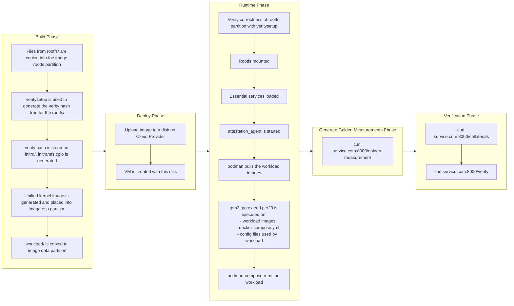

# cvm-base-image

## Prerequisites

1. For all cloud providers, you need to install these dependencies:
```
sudo apt install zip
```

2. You also need the cli for the cloud provider you want to deploy on (either az cli, gcloud cli or aws cli)
- az cli:
  - Download: [Guide](https://learn.microsoft.com/en-us/cli/azure/install-azure-cli)
  - Login: [Guide](https://learn.microsoft.com/en-us/cli/azure/authenticate-azure-cli)
- gcloud cli:
  - Download: [Guide](https://cloud.google.com/sdk/docs/install)
  - Login: [Guide](https://cloud.google.com/sdk/docs/initializing)
- aws cli:
  - Download: [Guide](https://docs.aws.amazon.com/cli/latest/userguide/getting-started-install.html)
  - Login: [Guide](https://docs.aws.amazon.com/cli/latest/userguide/getting-started-quickstart.html)

3. Additional dependencies if deploying to AWS:
- Service Role: You need a service role called [vmimport](https://docs.aws.amazon.com/vm-import/latest/userguide/required-permissions.html#vmimport-role)
- An S3 bucket to store the disk: [Guide](https://docs.aws.amazon.com/AmazonS3/latest/userguide/create-bucket-overview.html)

4. Additional dependencies if deploying to GCP:
- A GCP bucket to store the disk: [Guide](https://cloud.google.com/storage/docs/creating-buckets#console)

5. Additional things you need to do if deploying to Azure:
- You need to modify the python script used by az cli:
```bash
# on Linux
sudo vim /opt/az/lib/python3.12/site-packages/azure/mgmt/compute/v2023_04_02/models/_compute_management_client_enums.py
# on mac
sudo vim /opt/homebrew/Cellar/azure-cli/${AZ_CLI_VERSION}/libexec/lib/python3.12/site-packages/azure/mgmt/compute/v2023_04_02/models/_compute_management_client_enums.py

# Below the line with this Enum Class
# class DiskSecurityTypes
# add this line:
    CONFIDENTIAL_VM_NON_PERSISTED_TPM = "ConfidentialVM_NonPersistedTPM"
    """Indicates Confidential VM disk with no encryption"""
```

## Download the cvm disk image
Please download a cvm disk image into the root of this repository. Please pick the disk according to the cloud provider you wish to deploy on:

- GCP: https://f004.backblazeb2.com/file/cvm-base-images/disk.raw
- AWS: https://f004.backblazeb2.com/file/cvm-base-images/disk.vmdk
- Azure: https://f004.backblazeb2.com/file/cvm-base-images/disk.vhd

> Note: Please ensure the the disk names are kept as is, as the scripts below assume that the disk names have not been changed.


## Deploying the disk and creating the CVM
Run the CLI to deploy the disk to the cloud provider.

1. To deploy to Azure:
```bash
./cvm-cli deploy-azure --additional_ports "80,443" --vm_name <name> --region "<region>" --resource_group <group> --vm_type "<type>"
```

The following parameters are optional, and default to:
- vm_name: cvm_test
- region: East US 2
- resource_group: cvm_testRg
- vm_type: Standard_DC2es_v5
- additional_ports: “”

2. To deploy to GCP:
```bash
./cvm-cli deploy-gcp --additional_ports "80,443" --vm_name <name> --region "<region>" --project_id <project id> --bucket <bucket_name> --vm_type "<type>"
```

The following **must** be provided:
- project_id: Name of the project to deploy into
- bucket : Name of the GCP bucket which will be used to temporarily store the disk image.

The following parameters are optional, and default to:
- vm_name: cvm-test
- region: asia-southeast1-b
- vm_type: c3-standard-4
- additional_ports: “”

3. To deploy to AWS:
```bash
./cvm-cli deploy-aws --additional_ports "80,443" --vm_name <name> --region "<region>" --bucket <bucket_name> --vm_type "<type>"
```

The following **must** be provided:
- bucket : Name of the S3 bucket which will be used to temporarily store the disk image. This **must** be in the same region as the VM.

The following parameters are optional, and default to:
- vm_name: cvm-test
- region: us-east-2
- vm_type: m6a.large
- additional_ports: “”

## Uploading workload to the CVM

### How to modify the `workload/` folder:
- In the folder, there are 3 things - a file called `docker-compose.yml` and 2 folders called `config/` and `secrets/`.
  - `docker-compose.yml` : This is a standard docker compose file that can be used to specify your workload. However, do note that podman-compose will run this file instead of docker-compose. While this generally works fine, there are some caveats:
    - Please see this [issue](https://github.com/containers/podman-compose/issues/575) regarding podman-compose and specific options in `depends_on`.
    - Images that are hosted on docker's official registry must be prefixed with `docker.io/`.
  - `config/` : Use this folder to store any files that will be mounted and used by the container. All the files in this folder will be measured by the init script before the container runs.
  - `secrets/`: Use this folder to store any files that will be mounted and used by the container, but should not be measured. Examples include cert private keys, or database credentials.
- Additionally, if you wish to load local images, simply put the `.tar` files for the container images into the `workload/` directory itself. This will be automatically detected and loaded.

### Upload the workload
Run the following command to upload your `workload/` folder to your deployed CVM:
```bash
./cvm-cli <VM IP> <API TOKEN>
```

## Creating the golden measurements
Now, you will also need to create the golden measurements for your CVM. This golden measurement will be used by verifiers to ensure that the CVM that they are interacting with can be trusted. The API that you can call depends on whether you intend to do off-chain verification or on-chain verification.

1. Once the VM ip is available and the VM has completely booted, query the attestation_agent on the CVM to get collaterals.

For off-chain:
```bash
curl <vm-ip>:8000/golden-measurement > collaterals.json
```

For on-chain:
```bash
TODO.
```

2. Publish the golden measurements for verifiers to reference.

For off-chain: the golden measurements can be stored anywhere that the workload can retrieve them, for example, on S3 storage.


For on-chain: TODO.


## Verifying the image and workload
To verify that the workload is running a CVM with the expected measurements, the verifier can undertake the following steps:
1. Retrieve the published golden measurements.
2. Use the cvm-agent to retrieve the collaterals required during verification: 
```
curl 127.0.0.1:7999/collaterals
```
3. Use the cvm-agent to verify the collaterals against the golden measurements:

For off-chain:
```
curl -X POST 127.0.0.1:7999/offchain-verify -H "Content-Type: application/json" \
  -d '{"collaterals": <string>, "golden_measurement": <string> }'
```

For on-chain:
```
TODO.
```

For more details on the APIs available on the cvm-agent, please check out [this document](docs/cvm-agent-api.md).

## Architecture

### Trust Architecture


The diagram illustrates the trust architecture of our CVM Design from the lowest levels (hardware) all the way up to the highest levels (the workload). The vTPM is also cryptographically bound to the underlying Trusted Execution Environment (TEE) hardware in order to prevent replay attacks from malicious CVMs operating outside the trusted environment.

### Measured Boot


Measured boot captures and records cryptographic measurements of each step in the boot sequence, from VM launch all the way to workload initialization. Additionally, it securely extends these measurements into the TPM's Platform Configuration Registers (PCRs). The values extended into the PCRs can then be used to verify the integrity and trustworthiness of the entire boot process.

### Workload Architecture


Within the CVM, two primary programs run concurrently: the cvm-agent and the workload. The workload may leverage the cvm-agent to retrieve and verify attestations and measurements, as well as dynamically update itself when new versions become available. In this design, the cvm-agent functions similarly to a sidecar, providing optional services for attestation and verification without tightly coupling itself to the primary workload. 

The cvm-agent provides a HTTP API as a means of communication, and more details of its API can be found in [this document](docs/cvm-agent-api.md).


### Workflow from Image Build -> Deployment -> Measurement


