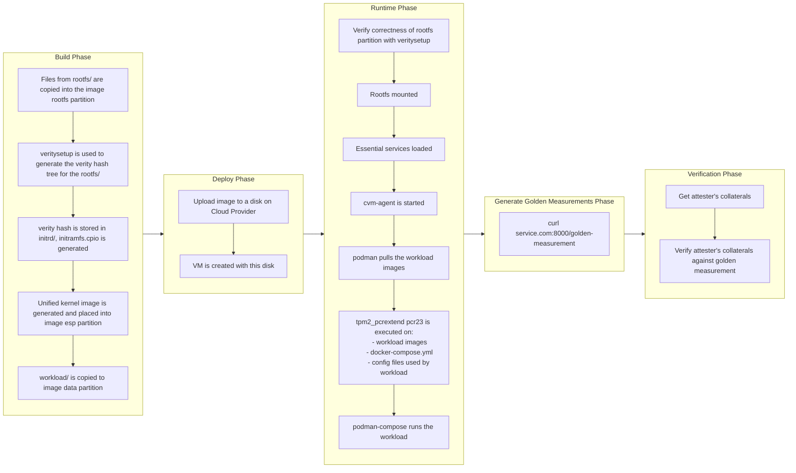

# cvm-base-image

## Prerequisites

1. You need the cli for the cloud provider you want to deploy on (either az cli, gcloud cli or aws cli)
   - az cli:
     - Download: [Guide](https://learn.microsoft.com/en-us/cli/azure/install-azure-cli)
     - Login: [Guide](https://learn.microsoft.com/en-us/cli/azure/authenticate-azure-cli)
   - gcloud cli:
     - Download: [Guide](https://cloud.google.com/sdk/docs/install)
     - Login: [Guide](https://cloud.google.com/sdk/docs/initializing)
   - aws cli:
     - Download: [Guide](https://docs.aws.amazon.com/cli/latest/userguide/getting-started-install.html)
     - Login: [Guide](https://docs.aws.amazon.com/cli/latest/userguide/getting-started-quickstart.html)

2. Additional dependencies if deploying to AWS:
   - Service Role: You need a service role called [vmimport](https://docs.aws.amazon.com/vm-import/latest/userguide/required-permissions.html#vmimport-role)
   - An S3 bucket to store the disk: [Guide](https://docs.aws.amazon.com/AmazonS3/latest/userguide/create-bucket-overview.html)

3. Additional dependencies if deploying to GCP:
   - A GCP bucket to store the disk: [Guide](https://cloud.google.com/storage/docs/creating-buckets#console)
   - Enable Compute Engine API on your chosen project:
   ```bash
   # Uses the default project that was selected during the gcloud cli initialization
   gcloud services enable compute.googleapis.com

   # To use a different project from the default project
   gcloud services enable compute.googleapis.com --project <PROJECT_ID>
   ```

4. Additional dependencies if deploying to Azure:
   - A resource group, a storage account, and image gallery
     - Note: Resource group, storage account, and shared image gallery must be in the same region as the VM you want to create. Please see the next section for details on the CVM types available in each region.
     - Note: SEV-SNP VMs may not be supported in the same region as TDX, so you may need to create separate resource groups, storage account and shared image gallery if you wish to support both CVM types on Azure.
     - Note: storage account name and shared image gallery name must be unique.
   ```bash
   # Fill up the variables with a name of your choice.
   RG="<resource group name>"
   REGION="<region>"
   STORAGE_ACCOUNT="<storage account name>" # lowercase letters and numbers only, length 3-24.
   GALLERY_NAME="<gallery name>"

   # Example variables could be:
   # RG="cvm_testRg"
   # REGION="East US 2"
   # STORAGE_ACCOUNT="tdxcvm123"
   # GALLERY_NAME="tdxGallery"

   # Create a resource groups
   az group create --name "$RG" --location "$REGION"

   # Create a storage account
   az storage account create --resource-group "$RG" --name "$STORAGE_ACCOUNT" --location "$REGION" --sku "Standard_LRS"

   # Create a shared image gallery
   az sig create --resource-group "$RG" --gallery-name "$GALLERY_NAME"
   ```

## CVM Information for each Cloud Provider 
This section outlines the confidential computing capabilities offered by major cloud providers, specifying supported CVM technologies—SEV-SNP and TDX—along with their corresponding instance families and available regions.

### AWS

- SEV-SNP:
  - Instance Family: [m6a, c6a, r6a](https://docs.aws.amazon.com/AWSEC2/latest/UserGuide/sev-snp.html#snp-requirements)
  - Region: us-east-2, eu-west-1
- TDX:
  - Not supported.


### Azure

- SEV-SNP:
  - Instance Family: [DCasV5](https://learn.microsoft.com/en-us/azure/virtual-machines/sizes/general-purpose/dcasv5-series?tabs=sizebasic)
  - Region: East US, West US, Switzerland North, Italy North, North Europe, West Europe, Germany West Central, UAE North, Japan East, Central India, East Asia, Southeast Asia

- TDX:
  - Instance Family: [DCesv5/DCedsv5](https://learn.microsoft.com/en-us/azure/virtual-machines/sizes/general-purpose/dcedsv5-series?tabs=sizebasic), [DCesv6](https://learn.microsoft.com/en-us/azure/virtual-machines/sizes/general-purpose/dcesv6-series?tabs=sizebasic)
  - Region:
    - DCesv5/DCedsv5: East US 2, Central US, West Europe, North Europe
    - DCesv6: West Europe, East US, West US, and West US 3

### GCP

- SEV-SNP:
  - Instance Family: [n2d-standard](https://cloud.google.com/compute/docs/general-purpose-machines#n2d_machine_types)
  - Region: asia-southeast1-a/b/c, europe-west3-a/b/c, europe-west4-a/b/c, us-central1-a/b/c
- TDX:
  - Instance Family: [c3-standard](https://cloud.google.com/compute/docs/general-purpose-machines#c3_machine_types)
  - Region: asia-southeast1-a/b/c, europe-west4-a/b/c, us-central1-a/b/c


## Download the CVM disk image
Please download a CVM disk image into the root of this repository. Please pick the disk according to the cloud provider you wish to deploy on:

```
# GCP Image
curl -O https://f004.backblazeb2.com/file/cvm-base-images/gcp_disk.tar.gz

# AWS Image
curl -O https://f004.backblazeb2.com/file/cvm-base-images/aws_disk.vmdk

# Azure Image
curl -O https://f004.backblazeb2.com/file/cvm-base-images/azure_disk.vhd
```
> [!Note]
> Please ensure the the disk names are kept as is, as the scripts below assume that the disk names have not been changed.


## Deploying the disk and creating the CVM
Run the CLI to deploy the disk to the cloud provider.

1. To deploy to Azure:
```bash
./cvm-cli deploy-azure --resource_group <group> --storage_account <storage_account> --gallery_name <gallery_name> --additional_ports "80,443" --vm_name <name> --vm_type "<type>"
```
The following **must** be provided:
- storage_account: The name of the storage account to upload the cvm disk into.
- gallery_name: The name of the shared image gallery to use.
- resource_group: The name of the resource group to deploy the VM into. It must also contain the storage account and shared image gallery.

The following parameters are optional, and default to:
- vm_name: cvm_test
- vm_type: Standard_DC2es_v5 (Note: If the region used by your resource group does not support this VM type, creation of this VM will fail.)
- additional_ports: “”


2. To deploy to GCP:
```bash
./cvm-cli deploy-gcp --additional_ports "80,443" --vm_name <name> --region "<region>" --project_id <project id> --bucket <bucket_name> --vm_type "<type>"
```

The following **must** be provided:
- project_id: Name of the project to deploy into
- bucket : Name of the GCP bucket which will be used to temporarily store the disk image.

The following parameters are optional, and default to:
- vm_name: cvm-test
- region: asia-southeast1-b
- vm_type: c3-standard-4
- additional_ports: “”

3. To deploy to AWS:
```bash
./cvm-cli deploy-aws --additional_ports "80,443" --vm_name <name> --region "<region>" --bucket <bucket_name> --vm_type "<type>"
```

The following **must** be provided:
- bucket : Name of the S3 bucket which will be used to temporarily store the disk image. This **must** be in the same region as the VM.

The following parameters are optional, and default to:
- vm_name: cvm-test
- region: us-east-2
- vm_type: m6a.large
- additional_ports: “”

## Known Issues for AWS

AWS currently has a known issue where the [boot process may intermittently hang for an SEV-SNP VM](https://bugs.launchpad.net/cloud-images/+bug/2076217). If you're unable to curl the APIs provided in the next section, please reboot the VM.

## Uploading workload to the CVM

### 1. Create asymmetric keypairs

Create one or more asymmetric keypairs, which will be used for the following steps:
  - [Signing the docker images](#2-sign-the-docker-images-that-will-be-used)
  - [Signing the golden measurements](#2-sign-the-golden-measurements)
```bash
# ECC key
openssl ecparam -genkey -name prime256v1 -noout -out private.pem
openssl ec -in private.pem -pubout -out public.pem

# RSA key
openssl genpkey -algorithm RSA -out private.pem -pkeyopt rsa_keygen_bits:2048
openssl rsa -in private.pem -pubout -out public.pem
```

### 2. Sign the docker images that will be used

TODO

### 3. Modify the `workload/` folder:
- In the folder, there are 3 things - a file called `docker-compose.yml` and 2 folders called `config/` and `secrets/`.
  - `docker-compose.yml` : This is a standard docker compose file that can be used to specify your workload. However, do note that podman-compose will run this file instead of docker-compose. While this generally works fine, there are some caveats:
    - Please see this [issue](https://github.com/containers/podman-compose/issues/575) regarding podman-compose and specific options in `depends_on`.
    - Images that are hosted on docker's official registry must be prefixed with `docker.io/`.
  - `config/` : Use this folder to store any files that will be mounted and used by the container. All the files in this folder will be measured by the init script into the TPM PCR before the container runs.
  - `secrets/`: Use this folder to store any files that will be mounted and used by the container, but should not be measured. Examples include cert private keys, or database credentials.
- Additionally, if you wish to load local images, simply put the `.tar` files for the container images into the `workload/` directory itself. This will be automatically detected and loaded.

> [!IMPORTANT]
> If you have created any asymmetric keypairs in [Step 1](#1-create-asymmetric-keypairs), please also place the public keys into `workload/config/`.
> This is to ensure that the public keys will also be measured into the TPM PCR, and prevents against tampering.

### 4. Get the API Token
Run the following command to retrieve the API token required to upload your workload:
```bash
curl -k https://<VM IP>:8000/api-token ; echo
```

> [!IMPORTANT]
> The API token can only be retrieved once. Do not lose it, or you will need to re-create the VM from scratch!

### 5. Upload the workload
Run the following command to upload your `workload/` folder to your deployed CVM:
```bash
./cvm-cli update-workload <VM IP> <API TOKEN>
```

## Creating the golden measurements
> [!IMPORTANT]
> The golden measurements are required for the [verification phase](#verifying-the-image-and-workload), as they serve as the reference against which verifiers compare an attester's collaterals to confirm alignment with a known, expected state. The publisher of the workload should create and publish the golden measurement for verifiers to reference.

### 1. Get the golden measurements
Once the VM's external ip is available and the VM has completely booted, query the cvm-agent on the CVM to get the golden measurements.

For off-chain:
```bash
curl -k https://<VM IP>:8000/golden-measurement > golden-measurement.json
```

For on-chain:
```bash
TODO.
```

### 2. Sign the golden measurements

> [!NOTE]
> This step is optional, and depends on where the golden measurement will be hosted. For off-chain verification, it is recommended to sign the golden measurement if it will be hosted somewhere untrusted, like on a cloud provider's S3 bucket.

- For off-chain:
  - Step 1: Sign the golden measurement. A reference helper script has been provided in this repo:
   ```bash
   ./json_sig_tool.py sign golden-measurement.json private.pem -o signed-golden-measurement.json
   ```
  - Step 2: (Optional, Sanity check) Verify the signature
   ```bash
   ./json_sig_tool.py verify signed-golden-measurement.json public.pem
   ```
- For on-chain: TODO (is it needed?)

### 3. Publish the golden measurements
Publish the golden measurements for verifiers to reference.

- For off-chain:
  - The golden measurements can be stored anywhere that a verifier can retrieve them, for example, on S3 storage.
  - If the verifier is hosted externally from a TEE environment, the golden measurement can be hosted there as well.


- For on-chain: TODO.


## Verifying the image and workload
### Off-chain verification
To verify that the workload is running a CVM with the expected measurements, the verifier should undertake the following steps in general:
1. Retrieve the published golden measurements from remote.
   - Verify the signature on the golden measurement to ensure it can be trusted, if needed.
2. Retrieve collaterals from the workload running on the attester CVM.
   - As an example, the workload on the attester CVM can query the cvm-agent locally as follows:
     ```bash
     curl 127.0.0.1:7999/collaterals
     ```
3. Verify the collaterals against the published golden measurements.
   - If the verifier runs within a TEE environment that is created from our cvm-image, the verifier can use the cvm-agent to verify the collaterals against the published golden measurements:
     ```bash
     # Assuming that the verifier saves the collaterals as collaterals.json:
     jq -s '{ golden_measurement: (.[1].golden_measurement | @json), collaterals: (.[0] | @json) }' collaterals.json signed-golden-measurement.json | curl -X POST 127.0.0.1:7999/offchain-verify -H "Content-Type: application/json" -d @-
     ```
   - If the verifier runs outside of a TEE environment, the [cvm-verifier SDK](https://github.com/automata-network/cvm-verifier) can be used to verify the collaterals against the golden-measurement:
     ```bash
     # 1. Pull out the golden_measurement field
     jq -r '.golden_measurement | @json' signed-golden-measurement.json > golden-measurement.json
     # 2. Run the verifier. Assuming the verifier saves the collaterals as collaterals.json:
     cargo run --release --bin cvm-verifier collaterals.json golden-measurement.json
     ```


For a more concrete example of the verification workflow, please check out the [peer node verification workflow below](#example-peer-node-verification-workflow-off-chain).


### On-chain verification
```
TODO.
```

For more details on the APIs available on the cvm-agent, please check out [this document](docs/cvm-agent-api.md).


### Example: Peer Node Verification Workflow (Off-chain)


This use-case describes the remote attestation flow between two **Confidential Virtual Machines (VMs)**—an **attester** and a **verifier**—using **attestation agents** and optional **remote storage** for verification.


#### 🧩 Components

##### 🔐 Confidential VM (Attester)
- **Workload (attester):** Application that provides collaterals to **verifier** for verification.
- **Attestation Agent:** Retrieves attestation reports and platform-specific collateral (e.g., TCB info, certificates).

##### 🔎 Confidential VM (Verifier)
- **Workload (verifier):** Application that receives collaterals from **attester** and verifies the collaterals using its local **Attestation Agent**.
- **Attestation Agent:** Validates the integrity of the attester's collaterals using cryptographic operations.

##### 🗄️ Remote Storage
- Stores known-good reference values used by the verifier to compare against collaterals of **attester** (ie, the golden measurement).


#### 🔄 Attestation Flow
1. **Get Golden Value**  
  The **verifier workload** gets golden value of **attester workload** from **remote storage**.

2. **Initiates attestation request**  
   The **verifier workload** send the attestation req to **attester workload**.

3. **Collect Evidence**  
   The **attester workload** get the collaterals from its local **attestation agent** via `/collateral` endpoint.

4. **Respond to the attestation request**  
   The **attester workload** replies the verifier workload with its collaterals.

5. **Verify Evidence**  
   The **verifier workload** calls its **attestation agent** using `/offchain-verify` to perform cryptographic validation and verify trustworthiness.

#### ✅ Outcome

If verification succeeds, the **verifier** can trust the **attester's VM** and proceed with sensitive operations such as key sharing or secure computation.


## Architecture

### Trust Architecture


The diagram illustrates the trust architecture of our CVM Design from the lowest levels (hardware) all the way up to the highest levels (the workload). The vTPM is also cryptographically bound to the underlying Trusted Execution Environment (TEE) hardware in order to prevent replay attacks from malicious CVMs operating outside the trusted environment.

### Measured Boot


Measured boot captures and records cryptographic measurements of each step in the boot sequence, from VM launch all the way to workload initialization. Additionally, it securely extends these measurements into the TPM's Platform Configuration Registers (PCRs). The values extended into the PCRs can then be used to verify the integrity and trustworthiness of the entire boot process.

### Workload Architecture


Within the CVM, two primary programs run concurrently: the cvm-agent and the workload. The workload may leverage the cvm-agent to retrieve and verify attestations and measurements, as well as dynamically update itself when new versions become available. In this design, the cvm-agent functions similarly to a sidecar, providing optional services for attestation and verification without tightly coupling itself to the primary workload. 

The cvm-agent provides a HTTP API as a means of communication, and more details of its API can be found in [this document](docs/cvm-agent-api.md).


### Workflow from Image Build -> Deployment -> Measurement



## Troubleshooting
TBD.
