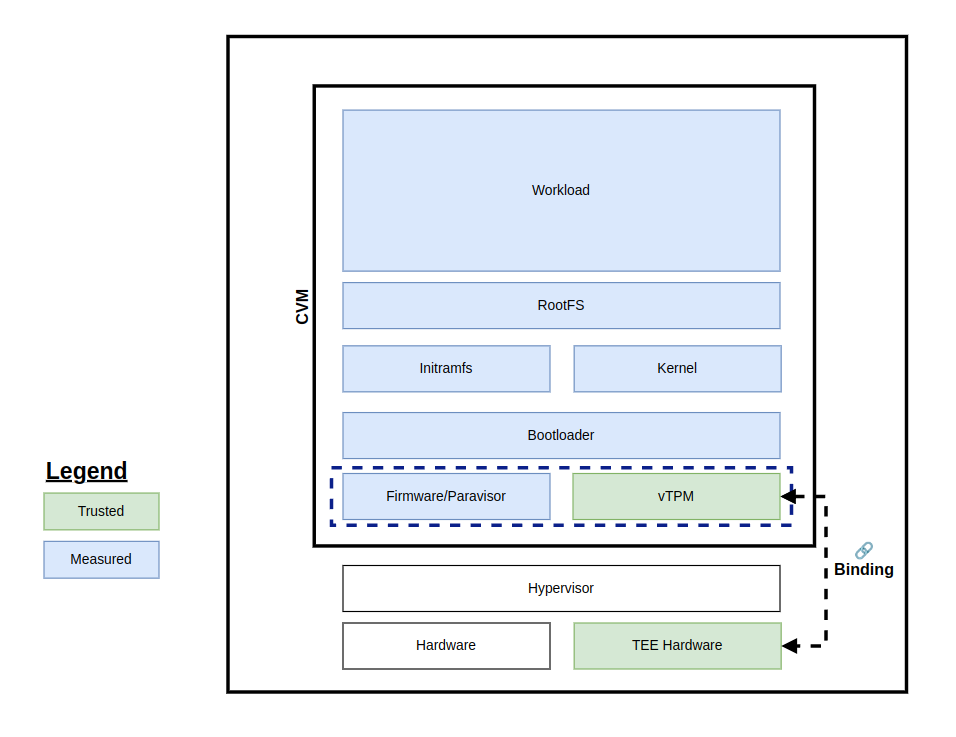
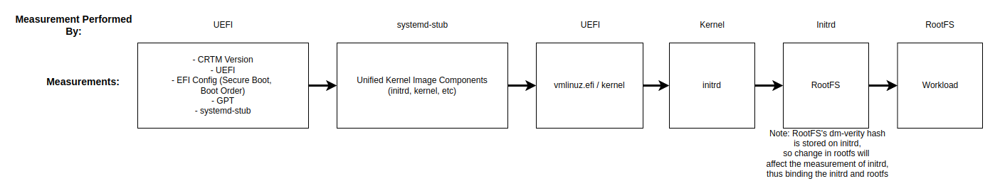
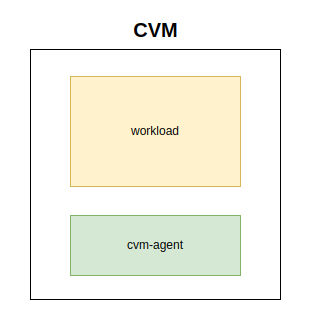
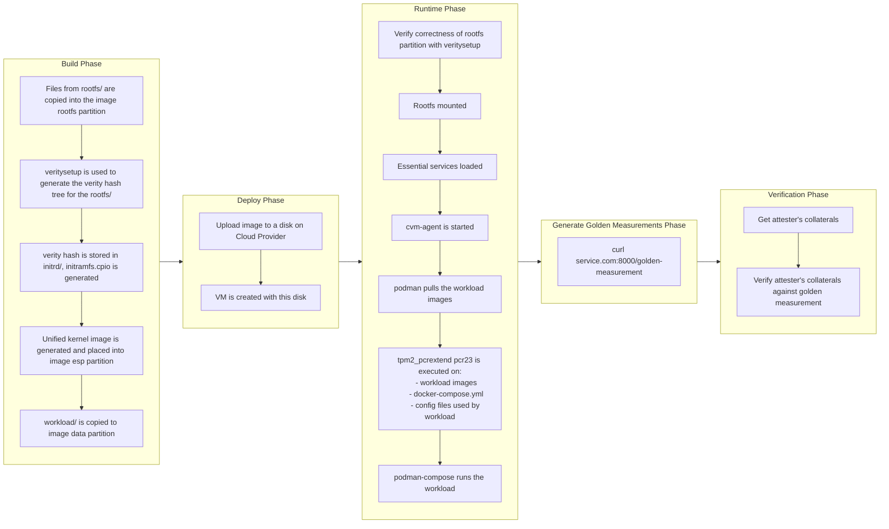

## Architecture

### Trust Architecture

The diagram illustrates the trust architecture of our CVM Design from the lowest levels (hardware) all the way up to the highest levels (the workload). The vTPM is also cryptographically bound to the underlying Trusted Execution Environment (TEE) hardware in order to prevent replay attacks from malicious CVMs operating outside the trusted environment.

### Measured Boot

Measured boot captures and records cryptographic measurements of each step in the boot sequence, from VM launch all the way to workload initialization. Additionally, it securely extends these measurements into the TPM's Platform Configuration Registers (PCRs). The values extended into the PCRs can then be used to verify the integrity and trustworthiness of the entire boot process.

### Workload Architecture

Within the CVM, two primary programs run concurrently: the cvm-agent and the workload. The workload may leverage the cvm-agent to retrieve and verify attestations and measurements, as well as dynamically update itself when new versions become available. In this design, the cvm-agent functions similarly to a sidecar, providing optional services for attestation and verification without tightly coupling itself to the primary workload. 

The cvm-agent provides a HTTP API as a means of communication, and more details of its API can be found in [this document](cvm-agent-api.md).

### Workflow from Image Build -> Deployment -> Measurement

