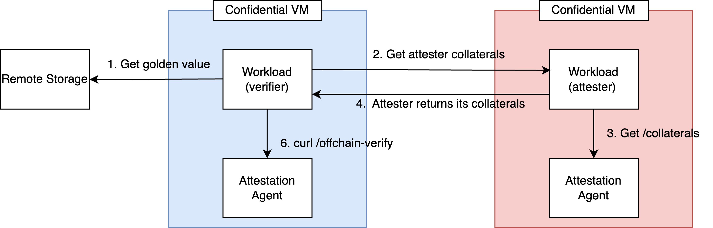

# Detailed Walkthrough

## 📑 Table of Contents <!-- omit in toc -->
- [Configure the `workload/` folder](#configure-the-workload-folder)
  - [1. Create asymmetric keypairs](#1-create-asymmetric-keypairs)
  - [2. Sign the docker images that will be used](#2-sign-the-docker-images-that-will-be-used)
  - [3. Modify the `workload/` folder:](#3-modify-the-workload-folder)
  - [4. Configure the cvm-agent and Security Policy](#4-configure-the-cvm-agent-and-security-policy)
  - [5. (Optional) Prepare additional data disk](#5-optional-prepare-additional-data-disk)
- [Deploying the workload onto the Cloud Provider](#deploying-the-workload-onto-the-cloud-provider)
  - [Deploying to Azure](#deploying-to-azure)
  - [Deploying to GCP](#deploying-to-gcp)
  - [Deploying to AWS](#deploying-to-aws)
- [Signing and Publishing the Golden Measurements](#signing-and-publishing-the-golden-measurements)
  - [1. Sign the golden measurements](#1-sign-the-golden-measurements)
  - [2. Publish the golden measurements](#2-publish-the-golden-measurements)
- [Verifying the image and workload](#verifying-the-image-and-workload)
  - [Off-chain verification](#off-chain-verification)
  - [On-chain verification](#on-chain-verification)
  - [Example: Peer Node Verification Workflow (Off-chain)](#example-peer-node-verification-workflow-off-chain)
    - [🧩 Components](#-components)
    - [🔄 Attestation Flow](#-attestation-flow)
    - [✅ Outcome](#-outcome)
- [Updating the workload](#updating-the-workload)
  - [1. Remember to sign the docker images that will be used](#1-remember-to-sign-the-docker-images-that-will-be-used)
  - [2. Update the `workload/` folder:](#2-update-the-workload-folder)
  - [3. Update the workload](#3-update-the-workload)
- [Adding your workload to a base disk image to distribute to other users](#adding-your-workload-to-a-base-disk-image-to-distribute-to-other-users)
- [(Advanced) Applying Critical Kernel Patches](#advanced-applying-critical-kernel-patches)


## Configure the `workload/` folder

### 1. Create asymmetric keypairs

Create asymmetric keypairs, which will be used for the following steps:
  - [Signing the docker images](#2-sign-the-docker-images-that-will-be-used)
  - [Signing the golden measurements](#2-sign-the-golden-measurements)
```bash
# 1. Generate a key for signing golden measurements
# ==================================================
# Option 1: ECC key
openssl ecparam -genkey -name prime256v1 -noout -out private.pem
openssl ec -in private.pem -pubout -out public.pem
# Option 2: RSA key
openssl genpkey -algorithm RSA -out private.pem -pkeyopt rsa_keygen_bits:2048
openssl rsa -in private.pem -pubout -out public.pem

# 2. Generate a key for image signing & verification
# ==================================================
cosign generate-key-pair
```

>[!Note]
> Please generate the image signing key using **cosign**. The key is designed for container image signing and verification.

### 2. Sign the docker images that will be used

For image signing and verification, please check out [this document](cvm-agent-image-signature-policy.md).

>[!Note]
> A sample image verification policy can be found in [workload/config/cvm_agent/sample_image_verify_policy.json](../workload/config/cvm_agent/sample_image_verify_policy.json)
> To enable the image verification, you should also configure the security policy of the cvm-agent. To see details regarding the security policy, please check [Configure the cvm-agent and Security Policy](#4-configure-the-cvm-agent-and-security-policy).

### 3. Modify the `workload/` folder:
- In the folder, there are 3 things - a file called `docker-compose.yml` and 2 folders called `config/` and `secrets/`.
  - `docker-compose.yml` : This is a standard docker compose file that can be used to specify your workload. However, do note that podman-compose will run this file instead of docker-compose. While this generally works fine, there are some caveats:
    - Please see this [issue](https://github.com/containers/podman-compose/issues/575) regarding podman-compose and specific options in `depends_on`.
    - Images that are hosted on docker's official registry must be prefixed with `docker.io/`.
  - `config/` : Use this folder to store any files that will be mounted and used by the container. All the files in this folder will be measured by the cvm-agent into the TPM PCR before the container runs.
  - `secrets/`: Use this folder to store any files that will be mounted and used by the container, but should not be measured. Examples include cert private keys, or database credentials.
  > ⚠️ **Security Implication**  
  > Files in `secrets/` are **not measured** and are embedded into the disk image **before deployment**.  
  > This means they are **visible to the Cloud Service Provider (CSP)** and **not protected by the hardware execution enviroment (TEE)**.  
  >  
  > 🔐 **Mitigation:** If confidentiality from the CSP is required:  
  > - **Avoid placing long-lived or highly sensitive secrets in `secrets/`.**
  > - Use a **remote secret management service**, such as:
  >   - [Key Broker Service](https://docs.trustauthority.intel.com/main/articles/articles/ita/key-broker-service.html?tabs=passport-verification-mode)
  > - Fetch secrets at runtime **only after attestation is verified**.

> [!IMPORTANT]
> If you have created any asymmetric keypairs in [Step 1](#1-create-asymmetric-keypairs), please also place the public keys into `workload/config/`.
> This is to ensure that the public keys will also be measured into the TPM PCR, and prevents against tampering.

> [!Caution]
> Remember to build your container images for X86_64, especially if you're using an ARM64 machine!


> [!Note]
> If you wish to load container images that are not published to any container registry, simply put the `.tar` files for the container images into the `workload/` directory itself. This will be automatically detected and loaded at runtime.


### 4. Configure the cvm-agent and Security Policy
The CVM agent runs inside the CVM and is responsible for VM management, workload measurement, and related tasks. The tasks that it is allowed to perform depends on a security policy, which can be configured by the user.

The default security policy can be found in [workload/config/cvm_agent/cvm_agent_policy.json](../workload/config/cvm_agent/cvm_agent_policy.json):

 There are 2 settings that you **must** configure:

- `firewall.allowed_ports`: By default, all incoming traffic on all ports are blocked, except for CVM agent ports 7999 and 8000. If your workload requires incoming traffic on other ports (eg. you need a p2p port on 30000), please follow the given example and add the ports you require.
- `workload_config.workload.update_white_list`: This list specifies which services in your docker-compose.yml are allowed to be updated remotely via the cvm-agent API `/update-workload`. **You must list the names of your services in your docker-compose.yml if you wish to allow remote updates. Otherwise, set it to an empty list `[]` to disallow remote updates.**

The other settings not mentioned can be left as its default values. If you wish to modify the other settings, a detailed description of each policy option can be found in [this document](cvm-agent-policy.md).

### 5. (Optional) Prepare additional data disk

By default, `cvm-cli` supports the creation of an additional data disk and attaching it to the CVM. Users only need to specify the disk name and size by adding `--attach-disk mydisk --disk-size 20` after `./cvm-cli deploy-<cloud provider name>`. For example:

```bash
# Option 1. Deploy to GCP
./cvm-cli deploy-gcp  --attach-disk mydisk --disk-size 20

# Option 2. Deploy to AWS
./cvm-cli deploy-aws --attach-disk mydisk --disk-size 20

# Option 3. Deploy to Azure
./cvm-cli deploy-azure --attach-disk mydisk --disk-size 20
```
> [!NOTE]
>  After the cvm is launched, the cvm will detect the unmounted disk and setup the filesystem if the disk is uninitialized and mount the disk at `/data/datadisk-1`.

If you want to manually create a custom disk, feel free to use the following commands to create your own disk and pass the disk name to the cmd `./cvm-cli deploy-<cloud provider name> --attach-disk <disk-name>`. The script will automatically detect the disk by its name and attach it to the vm.

- AZURE
```bash
az group create --name "$RG" --location "East US"

az disk create \
  --resource-group "$RG" \
  --name "$DATA_DISK" \
  --size-gb "$SIZE" \
  --sku Premium_LRS \
  --encryption-type EncryptionAtRestWithPlatformKey

./cvm-cli deploy-azure  --attach-disk $DATA_DISK
```

- GCP
```bash
gcloud projects list

gcloud compute disks create my-data-disk \
  --size=20GB \
  --type=pd-balanced \
  --zone=asia-southeast1-b \
  --project=YOUR_PROJECT_ID

 ./cvm-cli deploy-gcp  --attach-disk my-data-disk2
```

- AWS
```bash
FIRST_AZ=$(aws ec2 describe-availability-zones \
  --region us-east-2 \
  --query "AvailabilityZones[0].ZoneName" \
  --output text)

echo "First AZ: $FIRST_AZ"

aws ec2 create-volume \
  --region us-east-2 \
  --availability-zone $FIRST_AZ \
  --size 20 \
  --volume-type gp3 \
  --tag-specifications 'ResourceType=volume,Tags=[{Key=Name,Value=my-data-disk}]'

./cvm-cli deploy-aws --attach-disk my-data-disk
```
> [!NOTE]
>  Replace `us-east-1a` with the `availability-zone` you plan to use.  Make sure the disk is in the same `availability-zone` as the instance created by the script. Otherwise the disk cannot attach. By default, the script creates vm instance in the first availability-zone of the region. You can use above cmd to get it.


## Deploying the workload onto the Cloud Provider

> [!Warning]
> If you wish to enable kernel livepatching, please check the [kernel livepatch guide](livepatching.md) **before** deploying onto a CSP. Minimally, if you are:
> 
> - A developer distributing our base disk image with your custom workload: You should at least run `./cvm-cli generate-livepatch-keys` to create a set of asymmetric keys. These keys must be created before the disk is deployed onto a CVM on the cloud. When distributing the modified disk to operators, please also distribute `secure_boot/livepatch.crt`. You are responsible for creating the livepatches, signing them, and distributing them to operators.
> - An operator: Make sure you have received a disk image and `secure_boot/livepatch.crt` from the developer.

### Deploying to Azure
```bash
./cvm-cli deploy-azure --add-workload --vm_name <name> --vm_type "<type>" --region "<region>" --additional_ports "80,443"
```

**If you need to upload your workload onto the disk, please run this command with the `--add-workload` parameter.**


The following parameters are optional, and default to:
- vm_name: cvm_test
- vm_type: Standard_DC2es_v5
- region: East US 2
- additional_ports: “” (this option is for the cloud provider firewall, not the nftables firewall)
- resource_group: Depends on the vm_name
- storage_account: Randomly generated
- gallery_name: Randomly generated
- attach-disk: ""
- disk-size: ""


### Deploying to GCP
```bash
./cvm-cli deploy-gcp --add-workload --additional_ports "80,443" --vm_name <name> --region "<region>" --project_id <project id> --bucket <bucket_name> --vm_type "<type>" --ip "<ip>"
```


**If you need to upload your workload onto the disk, please run this command with the `--add-workload` parameter.**


The following parameters are optional, and default to:
- vm_name: cvm-test
- region: asia-southeast1-b
- vm_type: c3-standard-4
- additional_ports: “” (this option is for the cloud provider firewall, not the nftables firewall)
- project_id: Uses your default gcloud project
- bucket: Randomly generated.
- ip: "" (Use this option to attach a fixed static IP to your VM. Provide the IP address that you have reserved on GCP.)
- attach-disk: ""
- disk-size: ""

### Deploying to AWS
```bash
./cvm-cli deploy-aws --add-workload --additional_ports "80,443" --vm_name <name> --region "<region>" --bucket <bucket_name> --vm_type "<type>" --eip "<allocation ID>"
```

**If you need to upload your workload onto the disk, please run this command with the `--add-workload` parameter.**


The following parameters are optional, and default to:
- vm_name: cvm-test
- region: us-east-2
- vm_type: m6a.large
- additional_ports: “” (this option is for the cloud provider firewall, not the nftables firewall)
- bucket: Random name will be generated
- eip: "" (Use this option to attach a fixed static IP to your VM. Provide the allocation ID of an Elastic IP)
- attach-disk: ""
- disk-size: ""

> [!Warning]
> AWS currently has a known issue where the [boot process may intermittently hang for an SEV-SNP VM](https://bugs.launchpad.net/cloud-images/+bug/2076217). Please reboot the VM if you do not see a file called `_artifacts/golden-measurement.json` after the deployment script has completed. Once the VM has been rebooted, you can manually run `./scripts/get_golden_measurements.sh <csp> <vm-name>` to get the golden measurement.


## Signing and Publishing the Golden Measurements
> [!IMPORTANT]
> The golden measurements are required for the [verification phase](#verifying-the-image-and-workload), as they serve as the reference against which verifiers compare an attester's collaterals to confirm alignment with a known, expected state. The publisher of the workload should create and publish the golden measurement for verifiers to reference.

- Off-chain: After you have deployed the CVM on the cloud provider in the previous step, you should now have a file `_artifacts/golden-measurements/offchain/<csp>-<vm-name>.json`.
- On-chain: After you have deployed the CVM on the cloud provider in the previous step, you should now have a file `_artifacts/golden-measurements/onchain/<csp>-<vm-name>.json`.


### 1. Sign the golden measurements

> [!NOTE]
> This step is optional, and depends on where the golden measurement will be hosted. For off-chain verification, it is recommended to sign the golden measurement if it will be hosted somewhere untrusted, like on a cloud provider's S3 bucket.

- For off-chain:
  - Step 1: Sign the golden measurement. A reference helper script has been provided in this repo:
   ```bash
   ./tools/json_sig_tool.py sign _artifacts/golden-measurement.json private.pem -o signed-golden-measurement.json
   ```
  - Step 2: (Optional, Sanity check) Verify the signature
   ```bash
   ./tools/json_sig_tool.py verify signed-golden-measurement.json public.pem
   ```
- For on-chain: Assuming you use the default application contract which will be covered in the next sub-section, this is not required, because by default, only the owner can upload golden measurements to the contract. Otherwise, please remember to whitelist wallets which will be allowed to upload golden measurements. 

### 2. Publish the golden measurements
Publish the golden measurements for verifiers to reference.

- For off-chain:
  - The golden measurements can be stored anywhere that a verifier can retrieve them, for example, on S3 storage.
  - If the verifier is hosted externally from a TEE environment, the golden measurement can be hosted there as well.


- For on-chain:
  -  Please refer to to [this repo](https://github.com/automata-network/tee-workload-measurement) for the contracts. Automata maintains a TEE Registry contract which you can use, but you will have to deploy the application contract to a chain of your choice.
  -  For the application contract, you can modify and deploy the [sample application contract](https://github.com/automata-network/tee-workload-measurement/blob/main/contracts/src/mock/MockCVMExample.sol).
  -  Now, you can base64-decode the golden-measurements and abi-encode and upload this measurement to your application contract.


## Verifying the image and workload
### Off-chain verification
To verify that the workload is running a CVM with the expected measurements, the verifier should undertake the following steps in general:
1. Retrieve the published golden measurements from remote.
   - Verify the signature on the golden measurement to ensure it can be trusted, if needed.
2. Retrieve collaterals from the workload running on the attester CVM.
   - As an example, the workload on the attester CVM can query the cvm-agent locally as follows:
     ```bash
     curl 127.0.0.1:7999/collaterals/1234
     ```
3. Verify the collaterals against the published golden measurements.
   - If the verifier runs within a TEE environment that is created from our cvm-image, the verifier can use the cvm-agent to verify the collaterals against the published golden measurements:
     ```bash
     # Assuming that the verifier saves the collaterals as collaterals.json:
     jq -s '{ golden_measurement: (.[1].golden_measurement | @json), collaterals: (.[0] | @json) }' collaterals.json signed-golden-measurement.json | curl -X POST 127.0.0.1:7999/offchain-verify -H "Content-Type: application/json" -d @-
     ```
   - If the verifier runs outside of a TEE environment, the [cvm-verifier SDK](https://github.com/automata-network/cvm-verifier) can be used to verify the collaterals against the golden-measurement:
     ```bash
     # Run the verifier. Assuming the verifier saves the collaterals as collaterals.json:
     cargo run --release --bin cvm-verifier collaterals.json golden-measurement.json
     ```


For a more concrete example of the verification workflow, please check out the [peer node verification workflow below](#example-peer-node-verification-workflow-off-chain).


### On-chain verification
For on-chain verification, in order to minimize gas costs, there are two steps involved. The first is the registration of the CVM to an on-chain registry contract, and the second is the verification of the CVM on the on-chain user application contract.

#### 1. Registration

When the workload in the CVM starts, it should first retrieve its collaterals for registering on-chain. The following shows an example of how to retrieve the registration collaterals:

```bash
# Request to the cvm-agent, requesting a report that can be verified by Solidity
# report_type:
# 1: Solidity verification
# 2: SP1-zkProof verification
# 3: Risc0-zkProof verification
curl -X POST http://127.0.0.1:7999/onchain/registration-collaterals \
  -H "Content-Type: application/json" \
  -d '{"report_type": 1}'

# Response
# Calldata = abi.encode("attestCvm", cloudType, teeType, teeReportType, teeAttestationReport, workloadCollaterals)
{ "calldata": "<base64-encoded string>" }
```

The following example shows how to retrieve a report that uses zkProofs:
```bash
# report_type:
# 1: Solidity verification
# 2: SP1-zkProof verification
# 3: Risc0-zkProof verification
curl -X POST http://127.0.0.1:7999/onchain/registration-collaterals \
  -H "Content-Type: application/json" \
  -d '{"report_type": 3, "zk_config": { "image_id": "<string>", "url": "<api url>", "api_key": "<string>", "version": "<version>" }}'
```

In order to generate a zkProof, you will need to provide the fields **api key**, **image_id** and **version**. For details on how to sign up for an API key + what ImageID to use for either Risc0 or SP1, please check out the following repositories:
- [Automata SEV-SNP Attestation SDK](https://github.com/automata-network/amd-sev-snp-attestation-sdk)
- [Automata TDX Attestation SDK](https://github.com/automata-network/tdx-attestation-sdk)

For the `version`, these are the current versions we use:
- Risc0: `"2.2.0"`
- SP1: TBD.

Finally, the workload should base64-decode the calldata and submit a transaction to the on-chain registry contract with its data set to the base64-decoded calldata.

> [!Note]
> In the current version of the cvm-agent, only Solidity verification is supported for TDX and only Risc0 verification is supported for SEV-SNP. More methods will be supported in the future.

#### 2. Verification
The verifier will request the attester to sign a specific message that will be checked by the application contract. The verifier and the attester in this case can both be the same workload running in two different CVMs, depending on how the system is designed. There is a helper function on the CVM-agent called `/sign-message`, which can be used to achieve this message signing process. The following shows an example request to the CVM agent by the attester:

```bash
# Request to the cvm-agent
curl -X POST http://127.0.0.1:7999/sign-message \
  -H "Content-Type: application/json" \
  -d '{"message":"hello world"}'

# Response
{ "cvm_identity_hash": <base64-encoded string>, "signature": <base64-encoded string> }
```

> [!Note]
> In general, we recommend the message format to be the contract ABI encoding of `"CVM_WORKLOAD_USER_MESSAGE" || uint16(Chain ID) || application_contract_address || userMessage`.


Assuming that the verifier uses the default application contract as is, they will then need to:
- base64-decode the fields for cvm_identity_hash and signature
- abi encode it to get the calldata for: checkCVMSignature(bytes32 cvmIdentityHash, bytes calldata message, bytes calldata signature)
- submit the transaction to the application contract to verify the message signed by the attester.

For an overall view of the whole interaction process, please checkout [this diagram](./onchain-workflows.md#cvm-verification).

#### 3. More details for on-chain attestation workflows 
Please check out [this doc](./onchain-workflows.md) for more details and diagrams on the full on-chain attestation workflows. 

For more details on the APIs available on the cvm-agent, please check out [this document](cvm-agent-api.md).


### Example: Peer Node Verification Workflow (Off-chain)


This use-case describes the remote attestation flow between two **Confidential Virtual Machines (VMs)**—an **attester** and a **verifier**—using **attestation agents** and optional **remote storage** for verification.


#### 🧩 Components

##### 🔐 Confidential VM (Attester)
- **Workload (attester):** Application that provides collaterals to **verifier** for verification.
- **Attestation Agent:** Retrieves attestation reports and platform-specific collateral (e.g., TCB info, certificates).

##### 🔎 Confidential VM (Verifier)
- **Workload (verifier):** Application that receives collaterals from **attester** and verifies the collaterals using its local **Attestation Agent**.
- **Attestation Agent:** Validates the integrity of the attester's collaterals using cryptographic operations.

##### 🗄️ Remote Storage
- Stores known-good reference values used by the verifier to compare against collaterals of **attester** (ie, the golden measurement).


#### 🔄 Attestation Flow
1. **Get Golden Value**  
  The **verifier workload** gets golden value of **attester workload** from **remote storage**.

2. **Initiates attestation request**  
   The **verifier workload** send the attestation req to **attester workload**.

3. **Collect Evidence**  
   The **attester workload** get the collaterals from its local **attestation agent** via `/collateral` endpoint.

4. **Respond to the attestation request**  
   The **attester workload** replies the verifier workload with its collaterals.

5. **Verify Evidence**  
   The **verifier workload** calls its **attestation agent** using `/offchain-verify` to perform cryptographic validation and verify trustworthiness.

#### ✅ Outcome

If verification succeeds, the **verifier** can trust the **attester's VM** and proceed with sensitive operations such as key sharing or secure computation.


## Updating the workload

If the workload requires an update (eg. such as a new image version), the following steps can be taken:
>[!Note]
> If the podman runtime is selected in the agent policy, volume and network cannot be updated using this method.


### 1. Remember to sign the docker images that will be used

Please refer to [this step](#2-sign-the-docker-images-that-will-be-used) for details.

### 2. Update the `workload/` folder:
Please refer to [this step](#3-modify-the-workload-folder) for details.

### 3. Update the workload
Run the following command to upload your updated workload to your deployed CVM:
```bash
./cvm-cli update-workload <csp> <vm-name>
```

> [!Note]
> If you are having troubles updating the workload, you might have forgotten to set the `workload_config.workload.update_white_list`. Please see the above section on [configuring the security policy](#4-configure-the-cvm-agent-and-security-policy).

> [!Warning]
> Updating a workload remotely will cause the workload to be down for the duration of the update. Attestation measurements will also be reset, and any collateral verification that is performed by your workload will fail until you update the golden measurements.


## Adding your workload to a base disk image to distribute to other users

In case you wish to add your workload to a disk image to distribute to others for usage, you can undertake the following steps:

```bash
# 1. Download a disk for a CSP if you need
# ./cvm-cli get-disk <csp>
# <csp> : azure, gcp or aws
./cvm-cli get-disk azure

# 2. (Optional) Generate kernel livepatch keys if you want to enable livepatching.
./cvm-cli generate-livepatch-keys

# 3. Update the disk to add your workload contents onto it.
# These are the following disk file names for each CSP:
# GCP: gcp_disk.tar.gz
# Azure: azure_disk.vhd
# AWS: aws_disk.vmdk
./cvm-cli update-disk azure_disk.vhd
```

Now, the updated disk, `azure_dis.vhd` can be distributed to others. If you generated livepatch keys, please also distribute `secure_boot/livepatch.crt` to others to place in their `secure_boot/` folder.

## (Advanced) Applying Critical Kernel Patches

Our image supports kernel livepatching using kpatch. For more details, please check out the [kernel livepatching guide](livepatching.md).
