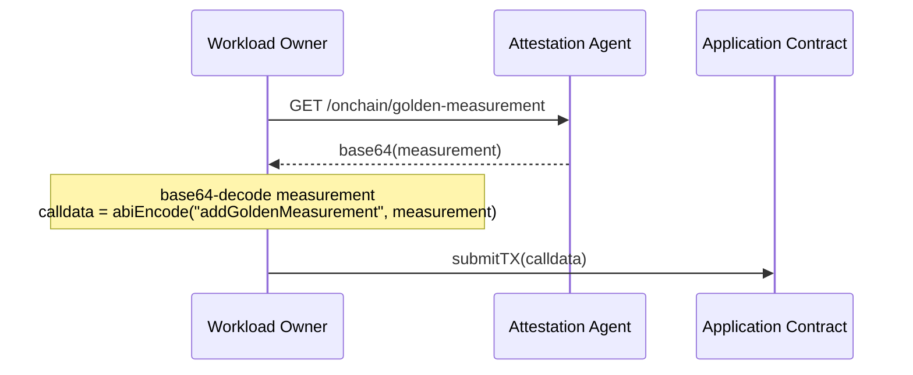
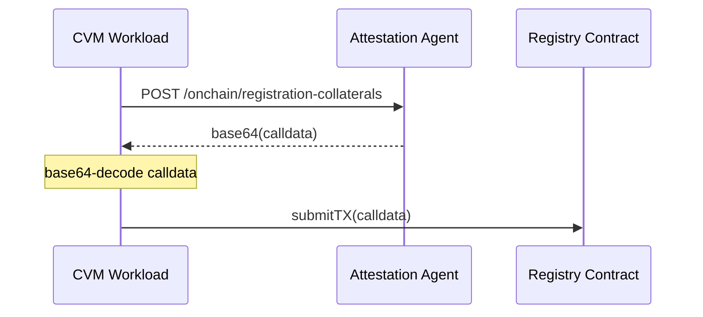
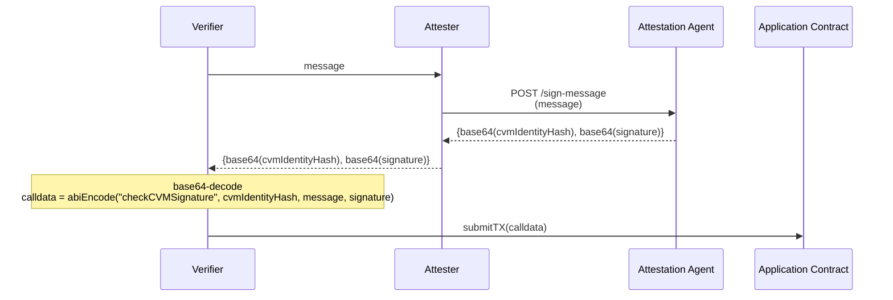
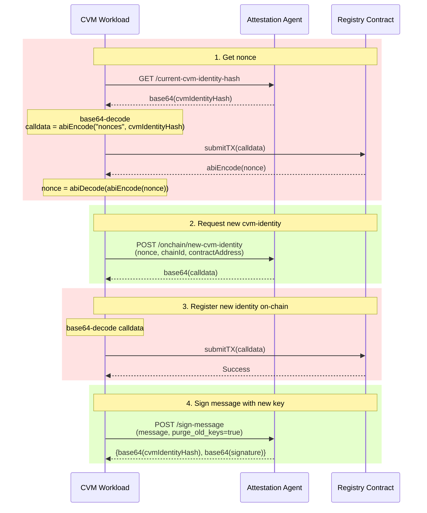

# On-chain Workflows

This document will host several diagrams that explain different parts of the on-chain attestation workflow at a high level.

## Uploading Golden Measurements

## CVM Registration

The registration process involves verifying all TEE collaterals and registering a VM-unique public key to represent the VM on the Registry contract. This registered public key will also thus be known as the "VM Identity". Once successful registration has happened, any message signed by this CVM's registered VM Identity Key can be considered trusted for a fixed TTL. Once the TTL has expired, the CVM must reattest its TEE collaterals with the Registry contract again. To reattest, simply perform the registration steps again.

In the above scenario, `calldata = abiEncode("attestCvm", cloudType, teeType, teeReportType, teeAttestationReport, workloadCollaterals)`.

## CVM Verification

In this workflow, we can assume that the Verifier and Attester are both workloads running in the CVM. (ie, they are performing mutual verification)

## Rotating CVM Identity

There are instances where the workload might want to rotate the key used for signing messages. This is a high level workflow of the steps that need to be taken to rotate the CVM's message signing key:

In the above diagram, for Step 3, `calldata = abiEncode("reattestCvmWithTpm", cvmIdentityHash, calldata signature, workloadCollaterals)`.
