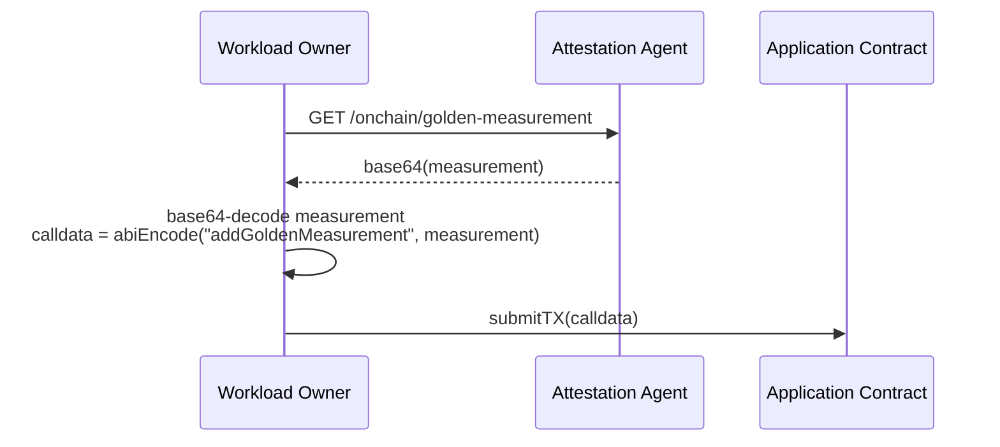
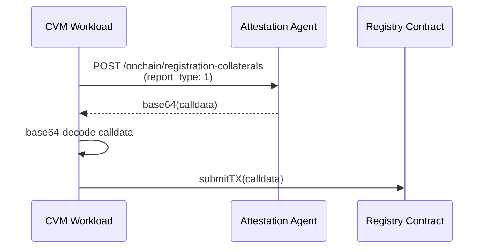
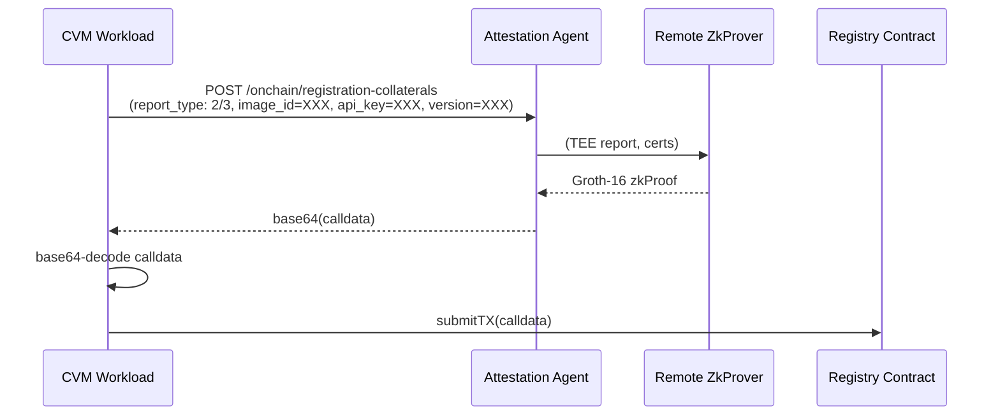
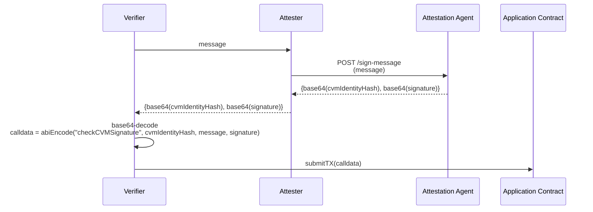
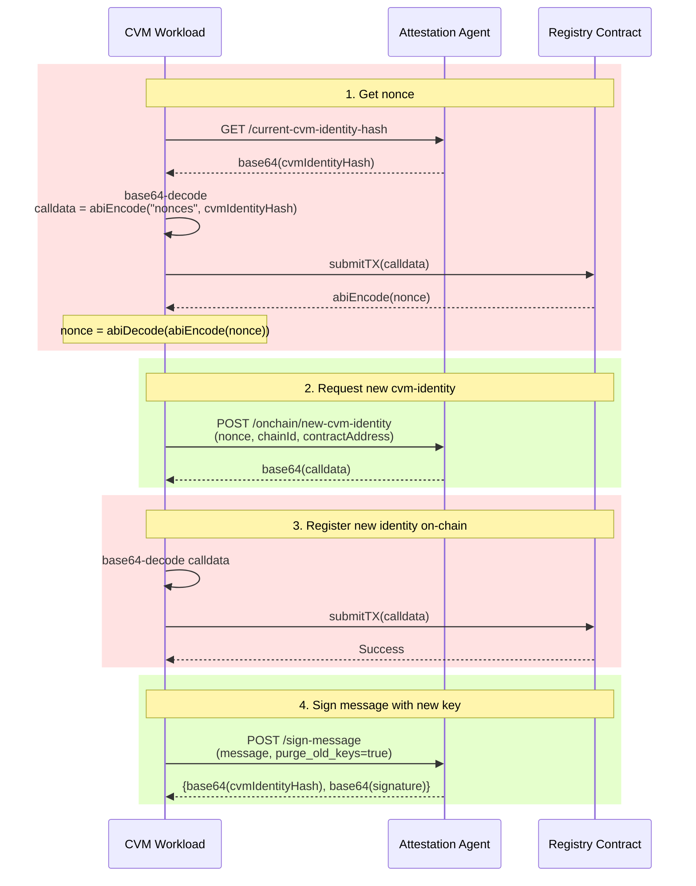
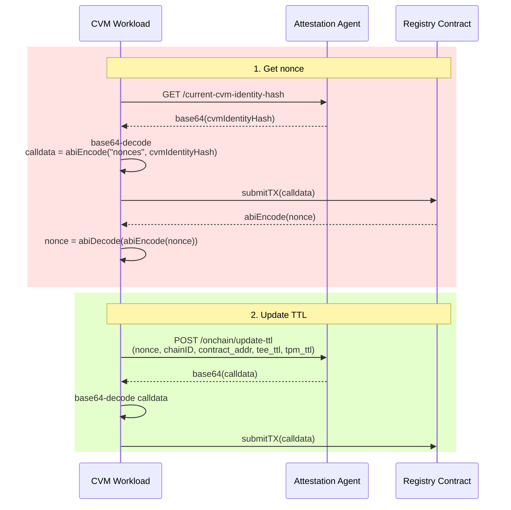

# On-chain Workflows

This document will host several diagrams that explain different parts of the on-chain attestation workflow at a high level.

## Uploading Golden Measurements

## CVM Registration

### Verification of TEE Collaterals
The registration process involves verifying all TEE collaterals on the CVM Registry Contract. We support two types of TEE attestation report verification - direct verification of signatures and certs on-chain (which we will call "Solidity verification"), or via a Groth-16 zkProof using either of the remote prover networks, Succinct SP1 or Risc0 Bonsai.

Below, we show the workflow of using direct Solidity Verification vs using zkProofs:

#### Solidity Verification

In the above scenario, `calldata = abiEncode("attestCvm", cloudType, teeType, teeReportType, teeAttestationReport, workloadCollaterals)`. Within the workloadCollaterals, the CVM Identity will be embedded and also hashed and signed as part of the TPM Quote Extra Data.

#### Groth-16 zkProof Verification
- When report_type = 2, Succinct SP1 zkProver network is used.
- When report_type = 3, Risc0 Bonsai zkProver network is used.

In the above scenario, `calldata = abiEncode("attestCvm", cloudType, teeType, teeReportType, zkProof, workloadCollaterals)`. Within the workloadCollaterals, the CVM Identity will be embedded and also hashed and signed as part of the TPM Quote Extra Data.

### Registration of CVM Identity
Once all TEE collaterals are verified, a VM-unique public key, which is sent together with the calldata, will be registered on the CVM Registry contract. This key will represent the CVM onchain. This registered public key will also thus be known as the "CVM Identity". After successful registration, any message signed by this CVM's registered VM Identity Key can be considered trusted for a fixed TTL. 

Once the TTL has expired, the CVM must reattest its TEE collaterals with the Registry contract again. To reattest, simply perform the registration steps again.

## CVM Verification

For the following example workflow that we will showcase, we make the following assumptions:
- That the Verifier and Attester are both workloads running in the CVM (ie, they are performing mutual verification). Note that this does not have to be the case, and depends on your workload architecture.
- The workload uses the [sample application contract](https://github.com/automata-network/cvm-onchain-verifier/blob/main/contracts/src/mock/MockCVMExample.sol) without any modifications to the function `checkCVMSignature`.

## Rotating CVM Identity

There are instances where the workload might want to rotate the key used for signing messages. This is a high level workflow of the steps that need to be taken to rotate the CVM's message signing key:

In the above diagram, for Step 3, `calldata = abiEncode("reattestCvmWithTpm", cvmIdentityHash, signature, workloadCollaterals)`.

## Updating TTL of CVM Measurements
By default, the TTL of TEE reports is 30days and the TTL of TPM Quotes is set to 60 days on the CVM Registry Contract. If you wish to make the TTL longer or shorter, they can be changed by following this workflow:

In the above diagram, for Step 2, `calldata = abiEncode("setCollateralTTL", cvmIdentityHash, teeTTL, tpmTTL, signature)`.