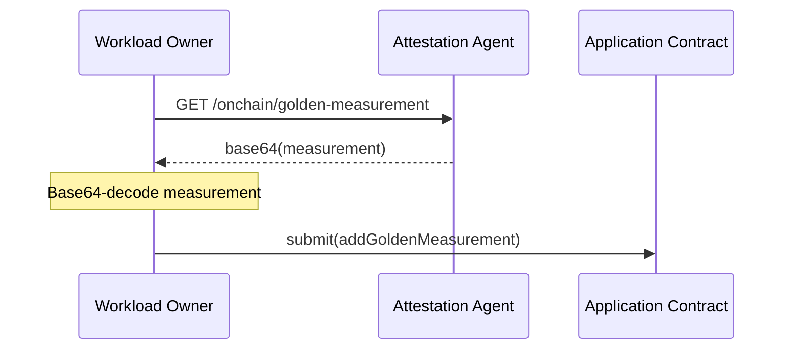
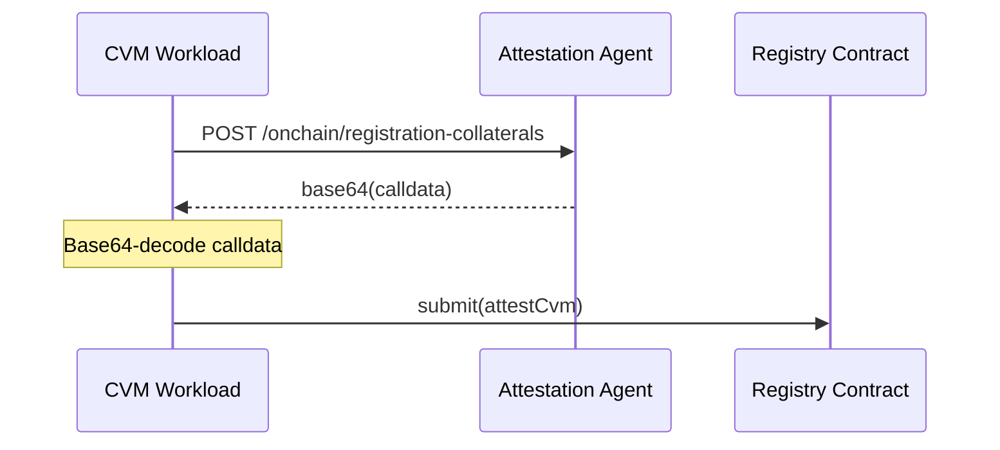
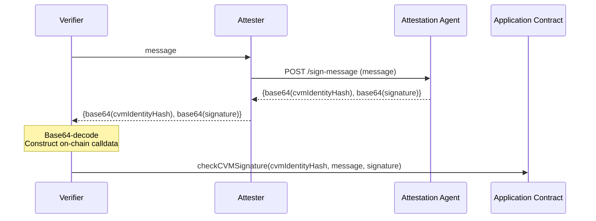
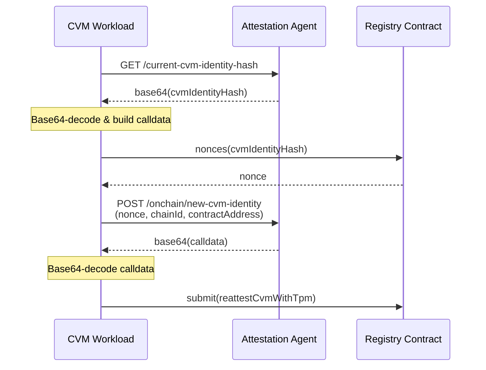

# On-chain Workflows

This document will host several diagrams that explain different parts of the on-chain attestation workflow at a high level.

## Uploading Golden Measurements

## CVM Registration

## CVM Verification

## Rotating CVM Identity

